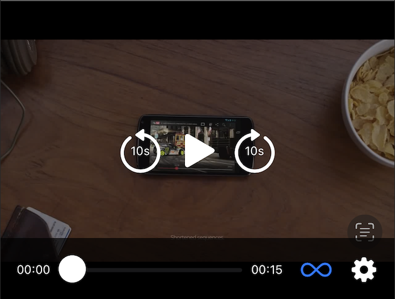

# iOS Enhanced media player

iOS media player package. Implemented in `SwiftUI` using `AVFoundation`.

## Table of Contents

- [Motivation](#motivation)
- [Minimum deployment target](#minimum-deployment-target)
- [Integration](#integration)
- [Features](#features)
- [Visual references](#visual-references)

## Motivation

Internal project focused on learning, training, and practicing media player
development. Our goal is to build a feature-rich media player, akin to those
found in commercial platforms like YouTube, using SwiftUI and other contemporary
development practices. This project serves as a valuable resource for future
reference, providing hands-on experience in media player creation for iOS platforms.

## Minimum deployment target

iOS 15.0

## Integration

How to integrate with an existing project (SPM or CocoaPod)

Swift Package Manage(SPM):

- Add a new package via github, using the branch `main`

CocoaPods:

- On your project create the `Podfile` bellow
- Run `pod install`

```ruby
platform :ios, '15.0'

target 'SampleApp' do
    pod 'EnhancedMediaPlayer', :git => 'https://github.com/profusion/ios-enhanced-media-player', :
branch => 'main'
end
```

### How to use

The package supports remote and stream video and remote music. It's only
necessary to provide the URL and the seekFactor.
The URL consists in a URL of the media that will be loaded. And the seek factor
consists in the value of the time interval in seconds to advance or rewind the
media to be played with the forward and reward actions (with buttons
or tapping the screen).

Here is an example of implementation:

```swift
import SwiftUI
import EnhancedMediaPlayer

struct ContentView: View {
    static let seekFactor: TimeInterval = 10
    static let urlExamples: URL = URL(string: "https://commondatastorage.googleapis.com/gtv-videos-bucket/sample/ForBiggerJoyrides.mp4")!
    
    var body: some View {
        MediaPlayer(url: urlExample, seekFactor: seekFactor)
            .frame(height: 300)
    }
}
```

An example of implementation can be found in the `ContentView.swift` file.

## Features

The project consists in a media player with the following features:

- Time bar (shows the passed and remaining time)
- Replay button
- Rewind and forward buttons or tapping the screen  (with customized interval,
the seek factor)
- Loop button (plays the video in loop when activated)
- Settings menu
- Support for SPM and CocoaPods integration

## Visual references

### Screenshots



### Videos


